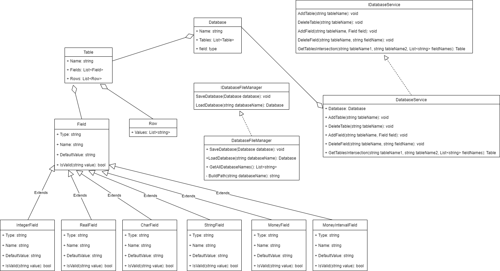
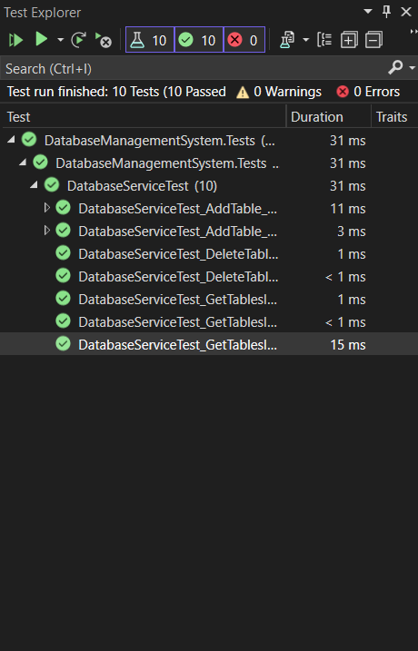
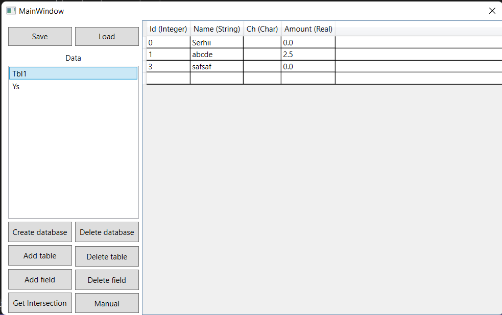

# Розробка локальної версії СКБД

* Розробка класів **Database**, **Table**, **Row**, **Field**
**Database** - клас для збереження бази даних. Містить поле Name - ім'я бази даних та колекцію таблиць.
```C#
    public class Database
    {
        public string Name { get; private set; }

        public ObservableCollection<Table> Tables { get; set; }

        public Database(string name)
        {
            Name = name;
            Tables = new ObservableCollection<Table>();
        }
    }
```
**Table** - клас для збереження таюлиці. Містить поле Name - ім'я таблиці, та колекцію рядків та полів. Також містить методи для додавання та видалення полів та рядків.
```C#
public class Table
    {
        public string Name { get; set; }

        public List<Field> Fields { get; set; }
        
        public List<Row> Rows { get; private set; }

        public Table(string name)
        {
            if(string.IsNullOrEmpty(name))
            {
                throw new Exception("Table name must not be empty");
            }
            Name = name;
            Fields = new List<Field>();
            Rows = new List<Row>();
        }

       ...
    }
```
**Field** - абстрактний клас для сутності поле. Має таких нащадків: IntegerField, CharField, StringField, RealField, MoneyField, MoneyIntervalField.
```C#
    public abstract class Field
    {
        public string Type { get; protected set; }
        public string Name { get; protected set; }
        public string DefaultValue { get; protected set; }
        public Field(string name)
        {
            Name = name;
        }
        public abstract bool IsValid(string value);
    }
```
```C#
    public class IntegerField : Field
    {
        public IntegerField(string name) : base(name)
        {
            Type = "Integer";
            DefaultValue = "0";
        }

        public override bool IsValid(string value)
        {
            return int.TryParse(value, out _);
        }
    }
```
```C#
public class CharField : Field
    {
        public CharField(string name) : base(name)
        {
            Type = "Char";
            DefaultValue = String.Empty;
        }

        public override bool IsValid(string value)
        {
            return char.TryParse(value, out _);
        }
    }
```
```C#
    public class StringField : Field
    {
        public StringField(string name) : base(name)
        {
            Type = "String";
            DefaultValue = String.Empty;
        }

        public override bool IsValid(string value)
        {
            return true;
        }
    }
```
```C#
    public class RealField : Field
    {
        public RealField(string name) : base(name)
        {
            Type = "Real";
            DefaultValue = "0.0";
        }

        public override bool IsValid(string value)
        {
            return double.TryParse(value, out _);
        }
    }
```
```C#
    public class MoneyField : Field
    {
        public MoneyField(string name) : base(name)
        {
            Type = "Money";
            DefaultValue = "$0.00";
        }

        public override bool IsValid(string value)
        {
            if(string.IsNullOrEmpty(value) || value[0] != '$')
                return false;
            if(value.Contains('.'))
            {
                string[] parts = value[1..].Split('.');
                if(parts.Length != 2 || !long.TryParse(parts[0], out _) || !int.TryParse(parts[1], out _) || parts[1].Length > 2 ||
                    parts[1].Length < 1)
                    return false;
            }
            else
            {
                return long.TryParse(value[1..], out _);
            }
            return true;
        }
    }
```
```C#
    public class MoneyIntervalField : Field
    {
        public MoneyIntervalField(string name) : base(name)
        {
            Type = "MoneyInterval";
            DefaultValue = "($0, $1)";
        }

        public override bool IsValid(string value)
        {
            if(string.IsNullOrEmpty(value) || (value[0] != '(' && value[0] != '[') || (value[^1] != ')' && value[^1] != ']'))
            {
                return false;
            }
            string[] parts = value[1..^1].Replace(" ", "").Split(',');
            MoneyField mf = new MoneyField("t");
            return mf.IsValid(parts[0]) && mf.IsValid(parts[1]);
        }
    }
```
**Row** - клас, що зберігає рядки таблиці. Містить колекцію значень Values.
```C#
    public class Row
    {
        public List<string> Values { get; set; }

        public Row()
        {
            Values = new List<string>();
        }
    }
```
* Створення UML-діаграми класів

<br>
* Проведення Unit тестування
Тестуємо додавання та видалення таблиць, а також розрахунок перетину таблиць. Використовується фреймворк NUnit.
```C#
[TestFixture]
    public class DatabaseServiceTest
    {
        private DatabaseService databaseService;
        [SetUp]
        public void SetUp()
        {
            databaseService = new DatabaseService();
            databaseService.Database = new Database("Database");
        }

        [Test, TestCaseSource(nameof(AddTable_CorrectData))]
        public void DatabaseServiceTest_AddTable_AddsTable(string tableName)
        {
            Assert.Multiple(() =>
            {
                Assert.DoesNotThrow(() => databaseService.AddTable(tableName));
                Assert.That(databaseService.Database.Tables, Has.Count.EqualTo(1));
            });
        }

        [Test, TestCaseSource(nameof(AddTable_InvalidData))]
        public void DatabaseServiceTest_AddTable_InvalidData(string tableName)
        {
            databaseService.AddTable("Table");
            Assert.Multiple(() =>
            {
                Assert.Throws<Exception>(() => databaseService.AddTable(tableName));
                Assert.That(databaseService.Database.Tables, Has.Count.EqualTo(1));
            });
        }

        [Test]
        public void DatabaseServiceTest_DeleteTable_DeletesTable()
        {
            var tableName = "Table";
            databaseService.AddTable(tableName);
            Assert.Multiple(() =>
            {
                Assert.DoesNotThrow(() => databaseService.DeleteTable(tableName));
                Assert.That(databaseService.Database.Tables, Is.Empty);
            });
        }

        [Test]
        public void DatabaseServiceTest_DeleteTable_DoesNotDeleteTable()
        {
            var tableName = "Table";
            Assert.Multiple(() =>
            {
                Assert.Throws<Exception>(() => databaseService.DeleteTable(tableName));
                Assert.That(databaseService.Database.Tables, Is.Empty);
            });
        }

        [Test, TestCaseSource(nameof(TableIntersection_CorrectData))]
        public void DatabaseServiceTest_GetTablesIntersection_ReturnsCorrectData(Table t1, Table t2, List<string> fields, Table expected)
        {
            databaseService.Database.Tables.Add(t1);
            databaseService.Database.Tables.Add(t2);

            var actual = databaseService.GetTablesIntersection(t1.Name, t2.Name, fields);
            var actualSerialized = JsonConvert.SerializeObject(actual);
            var expectedSerialized = JsonConvert.SerializeObject(expected);
            Assert.Multiple(() =>
            {
                Assert.DoesNotThrow(() => databaseService.GetTablesIntersection(t1.Name, t2.Name, fields));
                Assert.That(actualSerialized, Is.EqualTo(expectedSerialized));
            });
        }

        [Test, TestCaseSource(nameof(TableIntersection_CorrectData))]
        public void DatabaseServiceTest_GetTablesIntersection_NotExistingTable(Table t1, Table t2, List<string> fields, Table expected)
        {
            databaseService.Database.Tables.Add(t1);

            Assert.Throws<Exception>(() => databaseService.GetTablesIntersection(t1.Name, t2.Name, fields));
        }

        [Test, TestCaseSource(nameof(TableIntersection_InvalidFields))]
        public void DatabaseServiceTest_GetTablesIntersection_InvalidFields(Table t1, Table t2, List<string> fields)
        {
            databaseService.Database.Tables.Add(t1);
            databaseService.Database.Tables.Add(t2);

            Assert.Throws<Exception>(() => databaseService.GetTablesIntersection(t1.Name, t2.Name, fields));
        }

        #region data
        private static IEnumerable<TestCaseData> AddTable_CorrectData()
        {
            yield return new TestCaseData("Table1");
            yield return new TestCaseData("Table2");
            yield return new TestCaseData("Table3");
        }

        private static IEnumerable<TestCaseData> AddTable_InvalidData()
        {
            yield return new TestCaseData("");
            yield return new TestCaseData("Table");
        }

        private static IEnumerable<TestCaseData> TableIntersection_CorrectData()
        {
            yield return new TestCaseData(
                new Table("Table1")
                {
                    Fields = new List<Field>()
                    {
                        new IntegerField("Id"),
                        new StringField("Name"),
                        new CharField("Ch"),
                        new MoneyIntervalField("Balance")
                    }
                }.UpdateRow(new List<string> { "0", "Serhii", "s", "($4.00,$5.68)" }, 0)
                 .UpdateRow(new List<string> { "1", "Olha", "o", "($3.55,$2.86)" }, 1),
                new Table("Table2")
                {
                    Fields = new List<Field>()
                    {
                        new IntegerField("Id"),
                        new StringField("Name"),
                        new RealField("Prop"),
                        new MoneyIntervalField("Balance")
                    }
                }.UpdateRow(new List<string> { "0", "Serhii", "4.5", "($4.00,$5.68)" }, 0),
                new List<string> { "Id", "Name", "Balance" },
                new Table("Intersection of Table1 and Table2")
                {
                    Fields = new List<Field>()
                    {
                        new IntegerField("Id"),
                        new StringField("Name"),
                        new MoneyIntervalField("Balance")
                    }
                }.UpdateRow(new List<string> { "0", "Serhii", "($4.00,$5.68)" }, 0));
        }

        private static IEnumerable<TestCaseData> TableIntersection_InvalidFields()
        {
            yield return new TestCaseData(
                new Table("Table1")
                {
                    Fields = new List<Field>()
                    {
                        new IntegerField("Id"),
                        new StringField("Name"),
                        new CharField("Ch"),
                        new MoneyIntervalField("Balance")
                    }
                }.UpdateRow(new List<string> { "0", "Serhii", "s", "($4.00,$5.68)" }, 0)
                 .UpdateRow(new List<string> { "1", "Olha", "o", "($3.55,$2.86)" }, 1),
                new Table("Table2")
                {
                    Fields = new List<Field>()
                    {
                        new IntegerField("Id"),
                        new StringField("Name"),
                        new RealField("Prop"),
                        new MoneyIntervalField("Balance")
                    }
                }.UpdateRow(new List<string> { "0", "Serhii", "4.5", "($4.00,$5.68)" }, 0),
                new List<string> { "Id", "Ch", "Password" });
        }

        #endregion
    }
```
Результати виконання
<br>

<br>
* Забезпечення інтерфейсу користувача на основі форм
Для цього етапу використовувався WPF<br>
Застосунок має наступний функціонал:
* Зберегти базу
* Завантажити базу
* Створити базу
* Додати таблицю
* Видалити таблицю
* Додати поле
* Видалити поле
* Редагувати рядок
* Обчислити перетин таблиць
<br>

