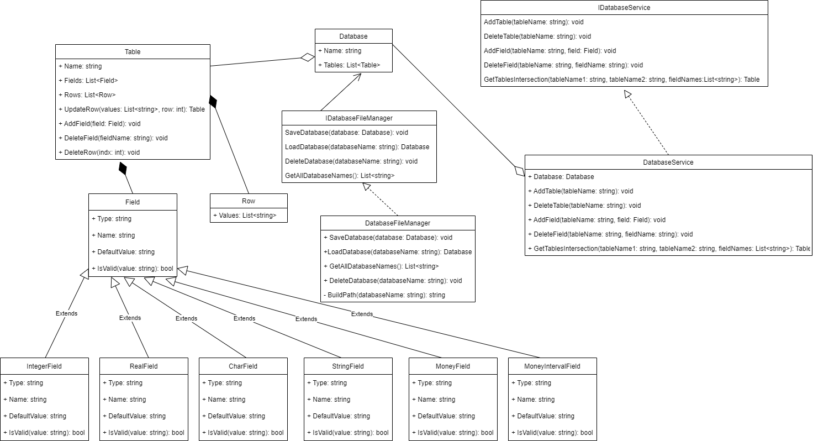

# Розробка локальної версії СКБД

* Розробка класів **Database**, **Table**, **Row**, **Field**
**Database** - клас для збереження бази даних. Містить поле Name - ім'я бази даних та колекцію таблиць.
```C#
    public class Database
    {
        public string Name { get; private set; }

        public ObservableCollection<Table> Tables { get; set; }

        public Database(string name)
        {
            Name = name;
            Tables = new ObservableCollection<Table>();
        }
    }
```
**Table** - клас для збереження таюлиці. Містить поле Name - ім'я таблиці, та колекцію рядків та полів. Також містить методи для додавання та видалення полів та рядків.
```C#
public class Table
    {
        public string Name { get; set; }

        public List<Field> Fields { get; set; }
        
        public List<Row> Rows { get; private set; }

        public Table(string name)
        {
            if(string.IsNullOrEmpty(name))
            {
                throw new Exception("Table name must not be empty");
            }
            Name = name;
            Fields = new List<Field>();
            Rows = new List<Row>();
        }

       ...
    }
```
**Field** - абстрактний клас для сутності поле. Має таких нащадків: IntegerField, CharField, StringField, RealField, MoneyField, MoneyIntervalField.
```C#
    public abstract class Field
    {
        public string Type { get; protected set; }
        public string Name { get; protected set; }
        public string DefaultValue { get; protected set; }
        public Field(string name)
        {
            Name = name;
        }
        public abstract bool IsValid(string value);
    }
```
```C#
    public class IntegerField : Field
    {
        public IntegerField(string name) : base(name)
        {
            Type = "Integer";
            DefaultValue = "0";
        }

        public override bool IsValid(string value)
        {
            return int.TryParse(value, out _);
        }
    }
```
```C#
public class CharField : Field
    {
        public CharField(string name) : base(name)
        {
            Type = "Char";
            DefaultValue = String.Empty;
        }

        public override bool IsValid(string value)
        {
            return char.TryParse(value, out _);
        }
    }
```
```C#
    public class StringField : Field
    {
        public StringField(string name) : base(name)
        {
            Type = "String";
            DefaultValue = String.Empty;
        }

        public override bool IsValid(string value)
        {
            return true;
        }
    }
```
```C#
    public class RealField : Field
    {
        public RealField(string name) : base(name)
        {
            Type = "Real";
            DefaultValue = "0.0";
        }

        public override bool IsValid(string value)
        {
            return double.TryParse(value, out _);
        }
    }
```
```C#
    public class MoneyField : Field
    {
        public MoneyField(string name) : base(name)
        {
            Type = "Money";
            DefaultValue = "$0.00";
        }

        public override bool IsValid(string value)
        {
            if(string.IsNullOrEmpty(value) || value[0] != '$')
                return false;
            if(value.Contains('.'))
            {
                string[] parts = value[1..].Split('.');
                if(parts.Length != 2 || !long.TryParse(parts[0], out _) || !int.TryParse(parts[1], out _) || parts[1].Length > 2 ||
                    parts[1].Length < 1)
                    return false;
            }
            else
            {
                return long.TryParse(value[1..], out _);
            }
            return true;
        }
    }
```
```C#
    public class MoneyIntervalField : Field
    {
        public MoneyIntervalField(string name) : base(name)
        {
            Type = "MoneyInterval";
            DefaultValue = "($0, $1)";
        }

        public override bool IsValid(string value)
        {
            if(string.IsNullOrEmpty(value) || (value[0] != '(' && value[0] != '[') || (value[^1] != ')' && value[^1] != ']'))
            {
                return false;
            }
            string[] parts = value[1..^1].Replace(" ", "").Split(',');
            MoneyField mf = new MoneyField("t");
            return mf.IsValid(parts[0]) && mf.IsValid(parts[1]);
        }
    }
```
**Row** - клас, що зберігає рядки таблиці. Містить колекцію значень Values.
```C#
    public class Row
    {
        public List<string> Values { get; set; }

        public Row()
        {
            Values = new List<string>();
        }
    }
```
* Створення UML-діаграми класів

<br>
* Проведення Unit тестування <br>
Тестуємо додавання та видалення таблиць, а також розрахунок перетину таблиць. Використовується фреймворк NUnit.
<br>

Результати виконання
<br>

<br>
* Забезпечення інтерфейсу користувача на основі форм
Для цього етапу використовувався WPF<br>
Застосунок має наступний функціонал:
* Зберегти базу
* Завантажити базу
* Створити базу
* Додати таблицю
* Видалити таблицю
* Додати поле
* Видалити поле
* Редагувати рядок
* Обчислити перетин таблиць
<br>

