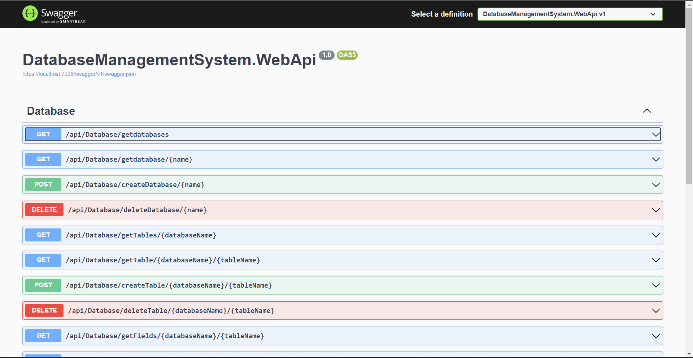
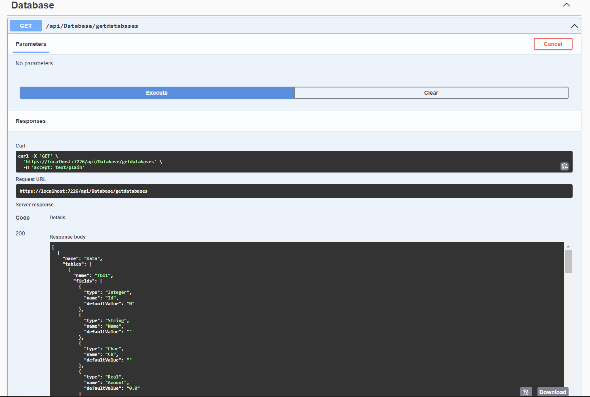

# Rest web-сервіси
# Розробка OpenApi Specification
# Asp.Net Web Api

Створимо Asp.Net Web Api проект та додамо в нього підтримку OpenApi. Також зареєструємо DatabaseFileManager та DatabaseService в DI контейнері.
```C#
using DatabaseManagementSystem.BL.DataServices;
using DatabaseManagementSystem.BL.FileManagers;

var builder = WebApplication.CreateBuilder(args);

// Add services to the container.

builder.Services.AddControllers();
// Learn more about configuring Swagger/OpenAPI at https://aka.ms/aspnetcore/swashbuckle
builder.Services.AddScoped<IDatabaseService, DatabaseService>();
builder.Services.AddScoped<IDatabaseFileManager, DatabaseFileManager>();
builder.Services.AddEndpointsApiExplorer();
builder.Services.AddSwaggerGen();

var app = builder.Build();

// Configure the HTTP request pipeline.
if(app.Environment.IsDevelopment())
{
    app.UseSwagger();
    app.UseSwaggerUI();
}

app.UseHttpsRedirection();

app.UseAuthorization();

app.MapControllers();

app.Run();
```
Додамо контролер з Get, Post, Put та Delete запитами до таких сутностей як Database, Table, Field, Row. Також додамо запит для обчислення перетину таблиць.
Отримуємо сторінку з OpenApi документацією всіх запитів.


```C#
[Route("api/[controller]")]
    [ApiController]
    public class DatabaseController : ControllerBase
    {
        private readonly IDatabaseFileManager _databaseFileManager;
        private readonly IDatabaseService _databaseService;

        public DatabaseController(IDatabaseFileManager databaseFileManager, IDatabaseService databaseService)
        {
            _databaseFileManager = databaseFileManager;
            _databaseService = databaseService;
        }

        [HttpGet]
        [Route("getdatabases")]
        public ActionResult<List<Database>> GetAllDatabases()
        {
            var databaseNames = _databaseFileManager.GetAllDatabaseNames();
            List<Database> result = new List<Database>();
            foreach(var databaseName in databaseNames)
            {
                var database = _databaseFileManager.LoadDatabase(databaseName);
                result.Add(database);
            }
            return Ok(result);
        }

        [HttpGet]
        [Route("getdatabase/{name}")]
        public ActionResult<Database> GetDatabaseByName(string name)
        {
            Database database;
            try
            {
                database = _databaseFileManager.LoadDatabase(name);
            }
            catch(Exception ex)
            {
                return BadRequest(ex.Message);
            }
            return Ok(database);
        }

        [HttpPost]
        [Route("createDatabase/{name}")]
        public ActionResult<Database> CreateDatabase(string name)
        {
            Database dt = new Database(name);
            try
            {
                _databaseFileManager.SaveDatabase(dt);
            }
            catch(Exception ex)
            {
                return BadRequest(ex.Message);
            }
            return Ok(dt);
        }

        [HttpDelete]
        [Route("deleteDatabase/{name}")]
        public ActionResult DeleteDatabase(string name)
        {
            try
            {
                _databaseFileManager.DeleteDatabase(name);
            }
            catch(Exception ex)
            {
                return BadRequest(ex.Message);
            }
            return Ok();
        }

        [HttpGet]
        [Route("getTables/{databaseName}")]
        public ActionResult<List<Table>> GetTables(string databaseName)
        {
            Database database;
            try
            {
                database = _databaseFileManager.LoadDatabase(databaseName);
            }
            catch(Exception ex)
            {
                return BadRequest(ex.Message);
            }
            return Ok(database.Tables);
        }

        [HttpGet]
        [Route("getTable/{databaseName}/{tableName}")]
        public ActionResult<Table> GetTable(string databaseName, string tableName)
        {
            Database database;
            try
            {
                database = _databaseFileManager.LoadDatabase(databaseName);
            }
            catch(Exception ex)
            {
                return BadRequest(ex.Message);
            }
            if(!database.Tables.Any(t => t.Name == tableName))
            {
                return BadRequest($"No table {tableName} in {databaseName}");
            }
            return Ok(database.Tables.First(t => t.Name == tableName));
        }

        [HttpPost]
        [Route("createTable/{databaseName}/{tableName}")]
        public ActionResult CreateTable(string databaseName, string tableName)
        {
            try
            {
                _databaseService.Database = _databaseFileManager.LoadDatabase(databaseName);
                _databaseService.AddTable(tableName);
                _databaseFileManager.SaveDatabase(_databaseService.Database);
            }
            catch(Exception ex)
            {
                return BadRequest(ex.Message);
            }
            return Ok();
        }

        [HttpDelete]
        [Route("deleteTable/{databaseName}/{tableName}")]
        public ActionResult DeleteTable(string databaseName, string tableName)
        {
            try
            {
                _databaseService.Database = _databaseFileManager.LoadDatabase(databaseName);
                _databaseService.DeleteTable(tableName);
                _databaseFileManager.SaveDatabase(_databaseService.Database);
            }
            catch(Exception ex)
            {
                return BadRequest(ex.Message);
            }
            return Ok();
        }

        [HttpGet]
        [Route("getFields/{databaseName}/{tableName}")]
        public ActionResult<List<Field>> GetFields(string databaseName, string tableName)
        {
            Database database;
            try
            {
                database = _databaseFileManager.LoadDatabase(databaseName);
            }
            catch(Exception ex)
            {
                return BadRequest(ex.Message);
            }
            if(!database.Tables.Any(t => t.Name == tableName))
            {
                return BadRequest($"No table {tableName} in databse {databaseName}");
            }
            return Ok(database.Tables.First(t => t.Name == tableName).Fields);
        }

        [HttpGet]
        [Route("getField/{databaseName}/{tableName}/{fieldName}")]
        public ActionResult<Field> GetField(string databaseName, string tableName, string fieldName)
        {
            Database database;
            try
            {
                database = _databaseFileManager.LoadDatabase(databaseName);
            }
            catch(Exception ex)
            {
                return BadRequest(ex.Message);
            }
            if(!database.Tables.Any(t => t.Name == tableName))
            {
                return BadRequest($"No table {tableName} in databse {databaseName}");
            }
            Field res = database.Tables.First(t => t.Name == tableName).Fields.FirstOrDefault(f => f.Name == fieldName);
            if(res == null)
            {
                return BadRequest($"No field {fieldName}");
            }
            return Ok(res);
        }

        [HttpPost]
        [Route("createField/{databaseName}/{tableName}/{fieldName}/{fieldType}")]
        public ActionResult CreateField(string databaseName, string tableName, string fieldName, string fieldType)
        {
            Database database;
            try
            {
                database = _databaseFileManager.LoadDatabase(databaseName);
                _databaseService.Database = database;
                _databaseService.AddField(tableName, fieldName, fieldType);
                _databaseFileManager.SaveDatabase(_databaseService.Database);
            }
            catch(Exception ex)
            {
                return BadRequest(ex.Message);
            }
            return Ok();
        }

        [HttpDelete]
        [Route("deleteField/{databaseName}/{tableName}/{fieldName}")]
        public ActionResult DeleteField(string databaseName, string tableName, string fieldName)
        {
            Database database;
            try
            {
                database = _databaseFileManager.LoadDatabase(databaseName);
                _databaseService.Database = database;
                _databaseService.DeleteField(tableName, fieldName);
                _databaseFileManager.SaveDatabase(_databaseService.Database);
            }
            catch(Exception ex)
            {
                return BadRequest(ex.Message);
            }
            return Ok();
        }

        [HttpGet]
        [Route("getRows/{databaseName}/{tableName}")]
        public ActionResult<List<Row>> GetRows(string databaseName, string tableName)
        {
            Database database;
            try
            {
                database = _databaseFileManager.LoadDatabase(databaseName);
            }
            catch(Exception ex)
            {
                return BadRequest(ex.Message);
            }
            Table t = database.Tables.FirstOrDefault(t => t.Name == tableName);
            if(t == null)
            {
                return BadRequest($"No table {tableName} in database {databaseName}");
            }
            return Ok(t.Rows.ToList());
        }

        [HttpPut]
        [Route("updateRow/{databaseName}/{tableName}/{rowIndex}")]
        public ActionResult UpdateRow(string databaseName, string tableName, int rowIndex, List<string> newValues)
        {
            Database database;
            try
            {
                database = _databaseFileManager.LoadDatabase(databaseName);
            }
            catch(Exception ex)
            {
                return BadRequest(ex.Message);
            }
            Table t = database.Tables.FirstOrDefault(t => t.Name == tableName);
            if(t == null)
            {
                return BadRequest($"No table {tableName} in database {database}");
            }
            try
            {
                t.UpdateRow(newValues, rowIndex);
                _databaseFileManager.SaveDatabase(database);
            }
            catch(Exception ex)
            {
                return BadRequest(ex.Message);
            }
            return Ok();
        }

        [HttpPost]
        [Route("getTablesIntersection/{databaseName}/{firstTableName}/{secondTableName}")]
        public ActionResult<Table> GetTablesIntersection(string databaseName, string firstTableName, string secondTableName, List<string> fieldNames)
        {
            Database database;
            Table result;
            try
            {
                database = _databaseFileManager.LoadDatabase(databaseName);
                _databaseService.Database = database;
                result = _databaseService.GetTablesIntersection(firstTableName, secondTableName, fieldNames);
            }
            catch(Exception ex)
            {
                return BadRequest(ex.Message);
            }
            return Ok(result);
        }
    }
    ```
